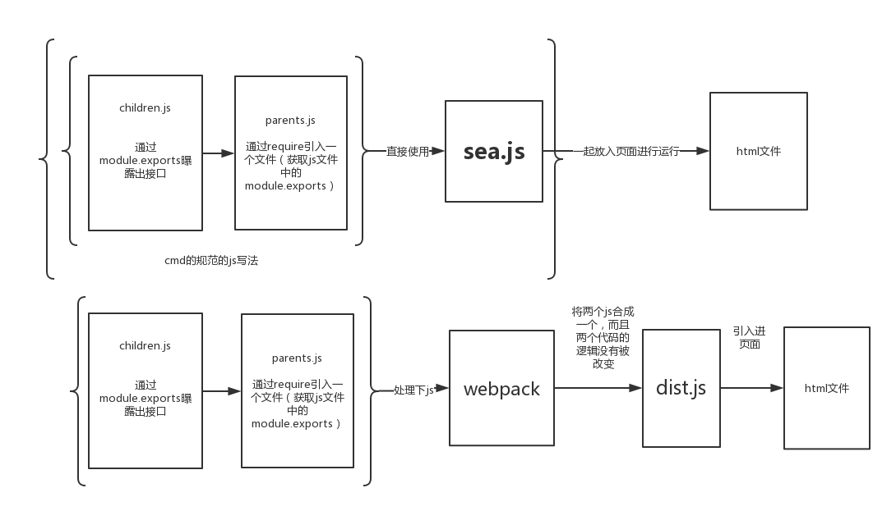
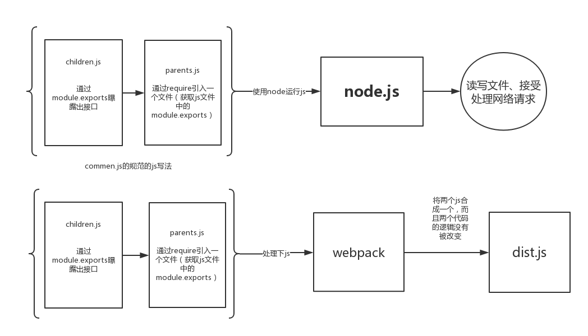

#webpack
##webpack
###网站
官网http://webpack.github.io/
1.X官方文档http://webpack.github.io/docs/
###什么是webpack？
webpack is a module bundler.
webpack是一个模块化的打包工具。---->先抛开node.js
sea.js+符合CMD规范开发的js文件---------->一起引入html进行执行
符合CMD规范开发的js文件---通过webpack的解析---->合并成一个js文件--->引入html进行执行


###webpack所支持的规范
CMD、AMD、CommonJS、ES2015 module
###webpack的使用
安装命令
npm install webpack -g
使用命令
webpack ./app.js app.bundle.js
###webpack配置文件
1. 文件名--->webpack.config.js
2. 配置文件,使用module.exports曝露出对象
3. 通过对对象属性的设置进而设置webpack的任务
```javascript
 module.exports = {
     entry: './src/app.js',
     output: {
         path: './bin',
         filename: 'app.bundle.js',
     }
 }
```
entry属性：用来配置要打包的入口文件
值可以是

1. 字符串  entry: './src/app.js'

2. 数组  entry: ['./src/app1.js','./src/app2.js']

3. 对象  对象的键名这里称之为块名（代码块的意思），块名可以在output属性中使用
entry: { 
    app1:"./src/app1.js",
    app2:"./src/app2.js",
}
 output: {
    path: './bin',
    filename: '[name].bundle.js',
}
###练习计算器打包
###webpack使用插件打包css
why

1. css 要怎么打包？为什么要打包css？

how

1. webpack是一个框架里面可以使用插件--->我们称之为loader(加载器)

2. 安装 style-loader css-loader  --->npm i

3. webpack.config.js中添加module属性，添加loaders上数组，
在loaders可以添加多个配置

4. {test:/\.css$/,loader:'style-loader!css-loader'}
test 使用正则去匹配要加载的文件
loader 使用什么加载器 后面的loader先被加载

5. 在js中require css文件

https://my.oschina.net/dawd/blog/788155

###webpack打包css自动添加浏览器内核前缀

1. 使用autoprefixer-loader
2. {test:/\.css$/,loader:'style-loader!autoprefixer-loader'}

###webpack打包less文件
1. 需要的包 less less-loader

###web打包sass文件
1. 需要的包 node-sass sass-loader